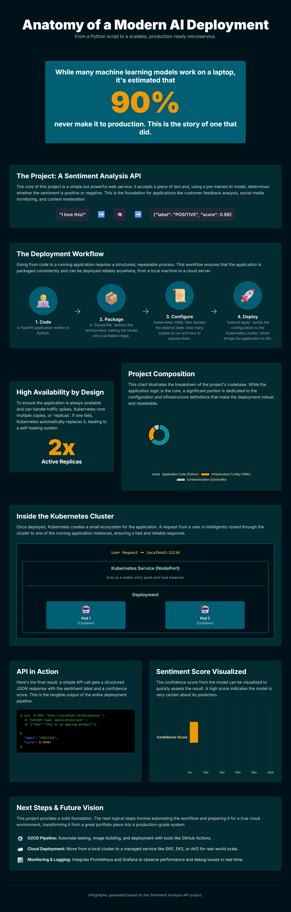
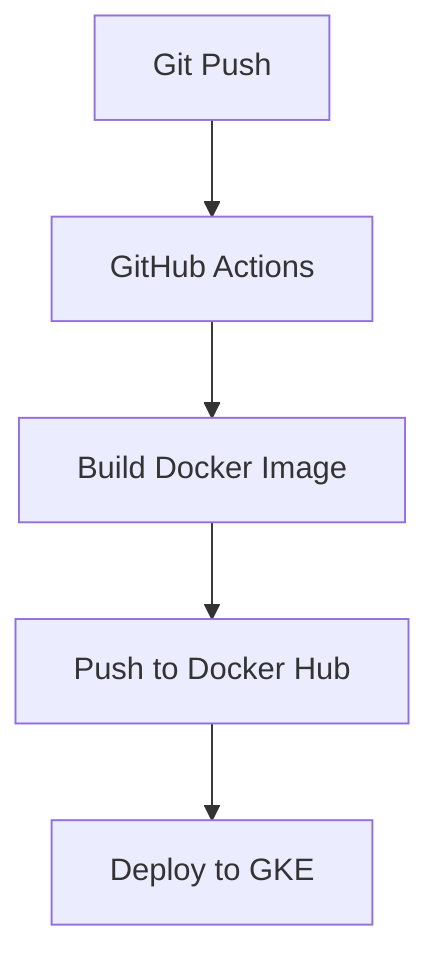

# Live Sentiment Analysis API (Deployed on GKE with CI/CD)



This is a complete, full-stack **MLOps project** that demonstrates the entire lifecycle of a machine learning application—from development to a live, automated deployment on the cloud.

The project features a **FastAPI backend**, a **containerized service managed by Kubernetes**, a fully automated **CI/CD pipeline with GitHub Actions**, and an **interactive web frontend**. The entire application is deployed and running on **Google Kubernetes Engine (GKE).**

---

## 🚀 Live Demo & Usage
This project is deployed live.  

- **Frontend URL:** [Sentiment Analysis Frontend](https://zaidnfs.github.io/Sentiment-Analysis/)  
- **Backend API URL:** [http://34.31.203.92](http://34.31.203.92)  

⚠️ **Important: How to Run the Demo**  
Due to browser security (Mixed Content), a secure **https** website (GitHub Pages) cannot directly call an insecure **http** API (your GKE IP).  

👉 The best way to run the full demo is **locally**:

```bash
# Clone this repository
git clone https://github.com/zaidnfs/Sentiment-Analysis.git
cd Sentiment-Analysis

# Start a local web server
python -m http.server

# Open the frontend in your browser
http://localhost:8000
```

This serves the frontend from a local **http** address, allowing it to connect to the live **http** backend on GKE.

---

## 🏛️ Architecture & CI/CD Pipeline

This project follows a modern, **cloud-native architecture**.  
The **CI/CD pipeline** is fully automated: every push to `main` triggers a workflow that builds, tests, and deploys to GKE.

### CI/CD Workflow


### Application Flow
```mermaid
graph LR
    U[User Browser] --> LB[Google Cloud Load Balancer]
    LB --> S[GKE Service]
    S --> P[Pod]
    P --> C[Container (API)]
```

---

## 🛠️ Tech Stack
- **Cloud:** Google Kubernetes Engine (GKE)  
- **CI/CD:** GitHub Actions  
- **Backend:** Python, FastAPI  
- **Containerization:** Docker, Docker Hub  
- **Orchestration:** Kubernetes  
- **Frontend:** HTML, Tailwind CSS, JavaScript  

---

## 🧪 API Usage (Directly via cURL)

Endpoint: `POST http://34.31.203.92/analyze`  

### Example Request:
```bash
curl -X POST "http://34.31.203.92/analyze" \
     -H "Content-Type: application/json" \
     -d '{"text": "This application is deployed live on the cloud!"}'
```

### Example Response:
```json
{
  "label": "POSITIVE",
  "score": 0.9999
}
```

---

<details>
<summary><strong>📦 Instructions to Deploy Your Own Version</strong></summary>

### Prerequisites
- Google Cloud account with a project created  
- Docker Hub account  
- `gcloud`, `git`, and `kubectl` installed  

### Steps
1. **Fork and Clone the Repository**  
2. **Create a GKE Cluster** and Service Account.  
3. **Configure GitHub Secrets** in your forked repo:  
   - `DOCKERHUB_USERNAME`: Your Docker Hub username  
   - `DOCKERHUB_TOKEN`: A Docker Hub access token  
   - `GKE_PROJECT`: Your Google Cloud project ID  
   - `GKE_SA_KEY`: JSON key for your Google Cloud service account  
4. **Update Config Files**:  
   - `deployment.yaml`: Point image to your Docker Hub repo  
   - `index.html`: Update `baseUrl` to your GKE external IP  
5. **Push Changes** → GitHub Actions will trigger the pipeline and deploy automatically.  

</details>

---

## 📈 Future Improvements
- [ ] **Domain Name & HTTPS**: Use custom domain + SSL/TLS with Ingress & cert-manager  
- [ ] **Monitoring & Alerting**: Add Prometheus & Grafana for real-time monitoring  
- [ ] **Infrastructure as Code (IaC)**: Manage GKE cluster with Terraform  

---

## 👨‍💻 Author
Developed by **Zaid 🚀**
